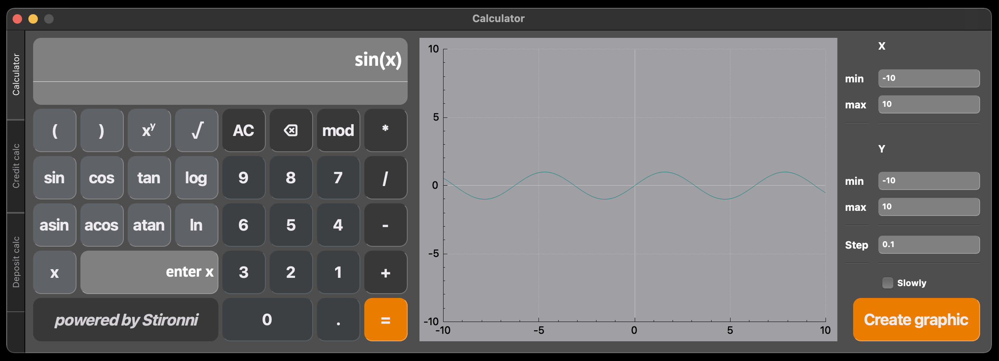
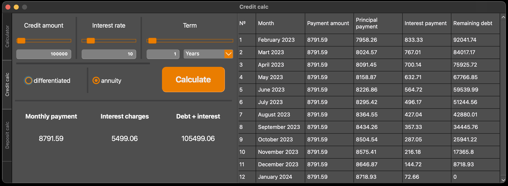
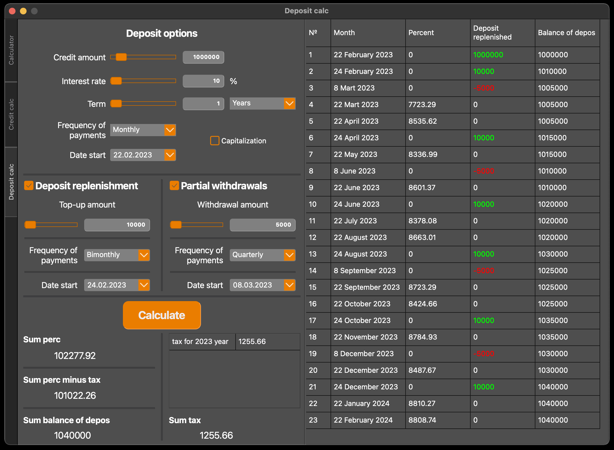

# SmartCalc v1.0

## Реализация

- Программа разработана на языке Си стандарта C11 с использованием компилятора gcc. Допустимо использование дополнительных библиотек и модулей QT
- Код программы находится в папке `src/files`
- Сборка программы настроена с помощью Makefile со стандартным набором целей для GNU-программ: all, install, uninstall, clean, dvi, dist, test, gcov_report. Установка ведется в каталог `src/build`
- Программа разработана в соответствии с принципами структурного программирования
- Код написан по стилю Google Style
- unit-тестами покрыты модули, связанных с вычислением выражений, с помощью библиотеки Check
- Реализация с графическим пользовательским интерфейсом, на базе GUI-библиотеки  QT с API
- На вход программы могут подаваться как целые числа, так и вещественные числа, записанные через точку.
- Вычисление производиться после полного ввода вычисляемого выражения и нажатия на символ `=` или клавиши `Enter`
- Реализовано вычисление произвольных скобочных арифметических выражений в инфиксной нотации
- Реализовано вычисление произвольных скобочных арифметических выражений в инфиксной нотации с подстановкой значения переменной _x_ в виде числа
- Реализовано построение графика функции, заданной с помощью выражения в инфиксной нотации с переменной _x_  (с координатными осями, отметкой используемого масштаба и сеткой с адаптивным шагом)
- Область определения и область значения функций ограничиваются числами от `-1000000 до 1000000`
- Проверяемая точность дробной части - минимум `7` знаков после запятой
- У пользователя есть возможность ввода до `255` символов
- Скобочные арифметические выражения в инфиксной нотации должны поддерживать следующие арифметические операции и математические функции:
    - **Арифметические операторы**:

      | Название оператора | Инфиксная нотация   (Классическая) | Префиксная нотация   (Польская нотация) |  Постфиксная нотация   (Обратная польская нотация) |
      | ------ | ------ | ------ | ------ |
      | Скобки | (a + b) | (+ a b) | a b + |
      | Сложение | a + b | + a b | a b + |
      | Вычитание | a - b | - a b | a b - |
      | Умножение | a * b | * a b | a b * |
      | Деление | a / b | / a b | a b \ |
      | Возведение в степень | a ^ b | ^ a b | a b ^ |
      | Остаток от деления | a mod b | mod a b | a b mod |
      | Унарный плюс | +a | +a | a+ |
      | Унарный минус | -a | -a | a- |

    - **Функции**:

      | Описание функции | Функция |   
      | ---------------- | ------- |  
      | Вычисляет косинус | cos(x) |   
      | Вычисляет синус | sin(x) |  
      | Вычисляет тангенс | tan(x) |  
      | Вычисляет арккосинус | acos(x) | 
      | Вычисляет арксинус | asin(x) | 
      | Вычисляет арктангенс | atan(x) |
      | Вычисляет квадратный корень | sqrt(x) |
      | Вычисляет натуральный логарифм | ln(x) | 
      | Вычисляет десятичный логарифм | log(x) |

    

_Реализация калькулятора_

## Кредитный калькулятор

Специальный режим "кредитный калькулятор" (за образец взят сайт calcus.ru):
- Вход: общая сумма кредита, срок, процентная ставка, тип (аннуитетный, дифференцированный)
- Выход: ежемесячный платеж, переплата по кредиту, общая выплата
- 

_Реализация кредитного калькулятора_

## Депозитный калькулятор

Специальный режим "калькулятор доходности вкладов" (за образец взят calcus.ru):
- Вход: сумма вклада, срок размещения, процентная ставка, налоговая ставка, периодичность выплат, капитализация процентов, список пополнений, список частичных снятий
- Выход: начисленные проценты, сумма налога, сумма на вкладе к концу срока

_Реализация депозитного калькулятора_
