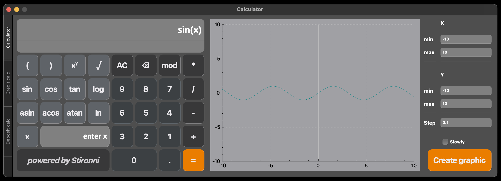

# SmartCalc v1.0

Руководство SmartCalc v1.0.

1. [Установка](#Установка)
2. [Вызов справки](#Вызов-справки)
3. [Создание архива](#Создание-архива)
4. [Посмотреть отчет](#Посмотреть-отчет)
5. [Описание SmartCalc v1.0](#Описание-SmartCalc-v1.0) \
   2.1. [Calculator](#Calculator) \
   2.2. [Graphs](#Graphs) \
   3.3. [Credit Calc](#Credit-Calc) \
   3.4. [Deposit Calc](#Deposit-Calc)
6. [Удаление](#Удаление)

## Установка

Для установки SmartCalc v1.0 перейдите в папку src и выполните в терминале:
> make install

Дождитесь окончания установки. В папке src появится папка build, а в папке src исполняемый файл SmartCalc_v1.

## Вызов справки

Чтобы посмотреть небольшую инструкцию, перейдите в папку src и выполните в терминале:
> make dvi

## Создание архива

Чтобы создать архив программы, перейдите в папку src и выполните в терминале:
> make dist

Дождитесь окончания архивации. В папке src появится файл SmartCalc_v1.tgz.

## Посмотреть отчет

Чтобы посмотреть отчет по покрытию кода тестами, перейдите в папку src и выполните в терминале:
> make gcov_report

## Описание SmartCalc v1.0

Запустив программу вы увидите следующее:

В программе реализован следующий функционал:
- Calculator - калькулятор.
- Create graphic - построение графика функции.
- Credit Calc - Кредитный калькулятор
- Deposit Calc - Депозитный калькулятор

## Calculator

Калькулятор позволяет проводить все арифметические операции, которые представлены на интерфейсе.
Представляется возможность вводить вычисляемое выражение с помощью клавиатуры.
При нажатии на "=" будет выводиться результат вычисления.
В случае некорректного ввода будет выведено "Non-corrective input".
При делении на нуль будет выведено "Division by 0"

## Graphs

Для построения графика функции введите область определения и область значения функции:
- min X может принимать значения от -1000000 до 1000000
- max X может принимать значения от -1000000 до 1000000
- min Y может принимать значения от -1000000 до 1000000
- max Y может принимать значения от -1000000 до 1000000

При построении графика функции Вы можете рассчитать значение функции (Y) задав определение функции (X).
Отображать график функции можно с помощью непрерываемой линии.
Если установить галку на Slowly, то график будет рисоваться медленно (данную опцию лучше использовать с наименьшей 
областью определения и наибольшим шагом).

## Credit Calc

Кредитный калькулятор позволяет рассчитать ежемесячный платеж по кредиту.
- Сумма кредита может быть только целым числом.
- Процент может быть только целым числом
- Срок можно выбрать в месяцах или годах

Также можно выбрать тип ежемесячного платежа: аннуитетный или дифференцированный

## Deposit Calc

Депозитный калькулятор представляет возможность рассчитать
начисленные проценты, сумму налога, налог по годам, сумму на вкладе к концу срока.
- Сумма вклада может быть в диапазоне от 0 до 10000000
- Срок размещения может быть в диапазоне от 1 до 1000 (дней, месяцев, лет)
- Процентная ставка может быть в диапазоне от 1 до 100
- Налог по кредиту в калькуляторе высчитывается следующим образом: 13% от разницы между доходностью по вкладу за год
  и суммой, необлагаемой налогом. Учитывая, что за 2022 год налог по вкладу был
  отменен, то налог высчитывается начиная с 2023 года. 
- Ключевая ставка ЦБ РФ 7.5%
- Также вклад можно просчитать с капитализацией.

Представляется возможность задать пополнение счета и частичное снятие со счета:
- Пополнение и снятие со счета можно совершать разово, каждый месяц, каждые 2 месяца, 
  каждый квартал, каждые полгода, каждый год.
- Не разрешается снимать со счета больше первоначально суммы вклада

## Удаление

Для удаления SmartCalc v1.0 перейдите в папку src и выполните в терминале:
> make uninstal
